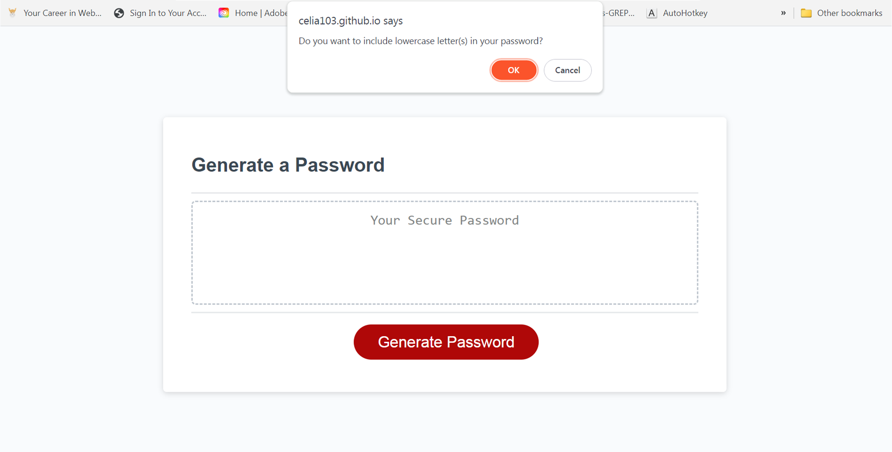
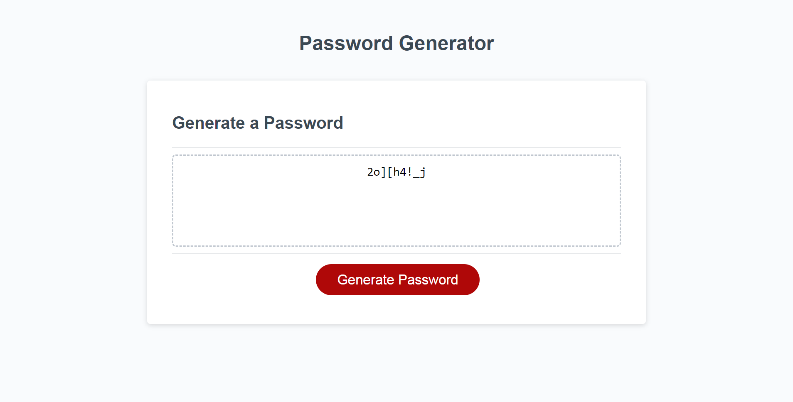

# W5-password-Generator

## Description
The task is to modify the starter code of an application that generates a random password. The application should allow users to select criteria for the password.

## Folder Structure

- **index.html**: The Main HTML file for this password generator.
- **asset:** includes 3 screenshot images.
  - **screencapture-W5-password-Generator-1.png:** Screenshot for the HTML file.
  - **screencapture-W5-password-Generator-2.png:** Screenshot for using the password generator.
  - **screencapture-W5-password-Generator-3.png:** Screenshot for password generated.
- **README.md:** This file.

## Links

[Visit my application](https://celia103.github.io/W5-password-Generator/)

[Visit the GitHub repository](https://github.com/celia103/W5-password-Generator)

- Application Screenshot:

- Screenshot for using the password generator:

- Screenshot for password generated:

## License

MIT License
